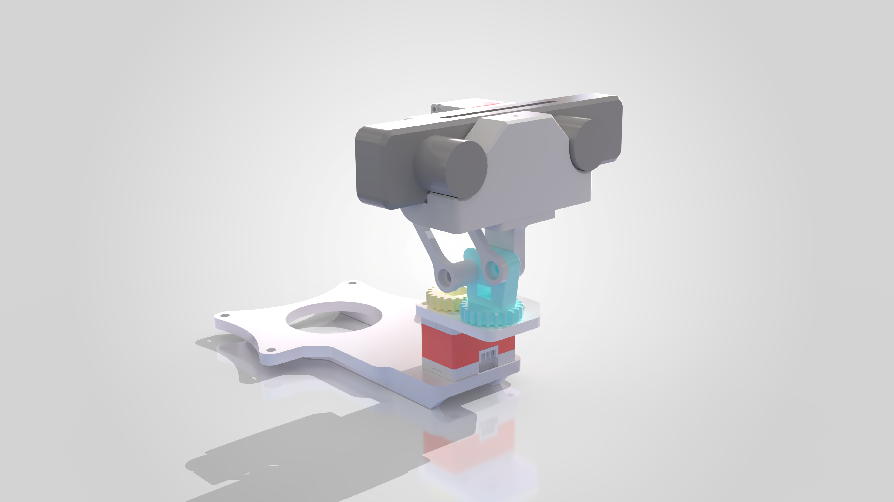
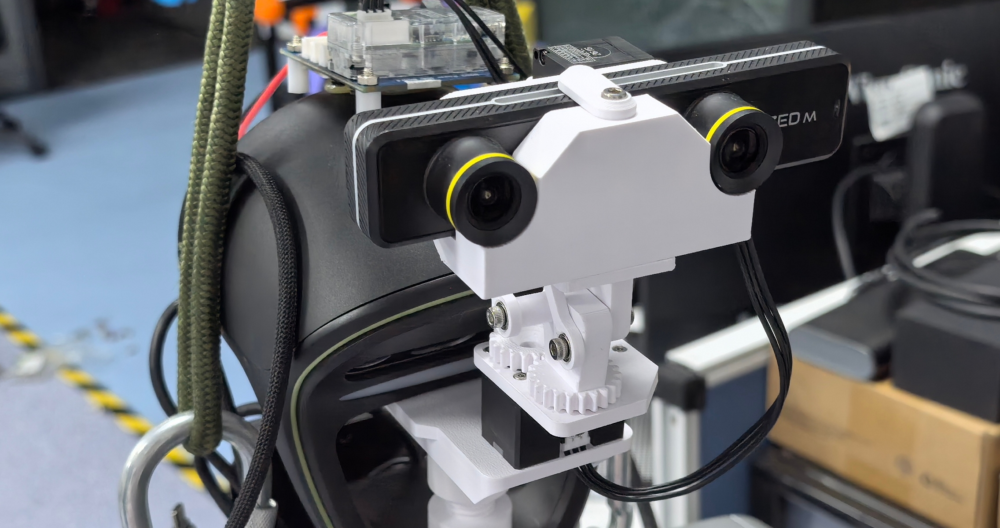

# OpenNeck

<p align="center">
  
  
</p>

<p align="center">
  <a href="LICENSE"></a>
  <a href="LICENSE"></a>
  
  
</p>

<p align="center">
  <strong>Languages:</strong>
  <strong>English</strong> · <a href="README.zh-CN.md">中文</a>
</p>

OpenNeck is an open-source 2-DoF robotic neck gimbal. The repository provides 3D-printable mechanical parts, a physical-angle-based software driver, and standalone URDF and MuJoCo simulation models.

## Features

- **Mechanical hardware** — editable STEP models, print-ready STL models, a sourcing list, and assembly instructions.
- **Software driver** — a Python API, command-line tools, servo maintenance tools, and center / mechanical-limit calibration. Supports both Feetech and Dynamixel servos via the `servo_backend` config field.
- **Simulation models** — standalone URDF and MuJoCo XML models with their supporting meshes.

## Quick Start

```bash
git clone --recurse-submodules https://github.com/FAST-CERN/OpenNeck.git
cd OpenNeck
pip install ".[dynamixel]"   # Feetech + Dynamixel; use `pip install .` for Feetech only
```

Then follow the [Software Driver guide](docs/en/software.md) to assign servo IDs and run calibration.

## Documentation

| Topic | English | 中文 |
|---|---|---|
| Software — install, calibration, configuration, CLI, API | [Software](docs/en/software.md) | [软件](docs/zh-CN/software.md) |
| Hardware — sourcing and 3D printing | [Hardware](docs/en/hardware.md) | [硬件](docs/zh-CN/hardware.md) |
| Mechanical assembly | [Assembly](docs/en/assembly.md) | [装配](docs/zh-CN/assembly.md) |
| Deploying into an existing environment (e.g. `teleopit`) | [Deployment](docs/en/deployment-teleopit.md) | [部署](docs/zh-CN/deployment-teleopit.md) |
| Upgrading from upstream BotRunner64 (API changes) | [Migration](docs/en/migration-from-upstream.md) | [迁移](docs/zh-CN/migration-from-upstream.md) |
| URDF model | [openneck.urdf](hardware/simulation/openneck.urdf) | — |
| MuJoCo model | [openneck.xml](hardware/simulation/openneck.xml) | — |

## Getting Started

Clone with `--recurse-submodules` so the Dynamixel SDK is fetched, or run `git submodule update --init --recursive` after cloning.

When building OpenNeck for the first time, follow these documents in order:

1. Use [Hardware Preparation](docs/en/hardware.md) to source the components and print the structural parts.
2. Follow [Mechanical Assembly](docs/en/assembly.md) to assemble the gimbal.
3. Follow [Software Driver](docs/en/software.md) to install the driver, assign servo IDs, and complete calibration.

## For Developers

Internal documentation index (design contracts, plans, progress, status): [`docs/README.md`](docs/README.md).

## Acknowledgments

The hardware design and implementation of OpenNeck were completed by [zc-xzc](https://github.com/zc-xzc).

## License

This project is licensed under the [Apache License 2.0](LICENSE).
