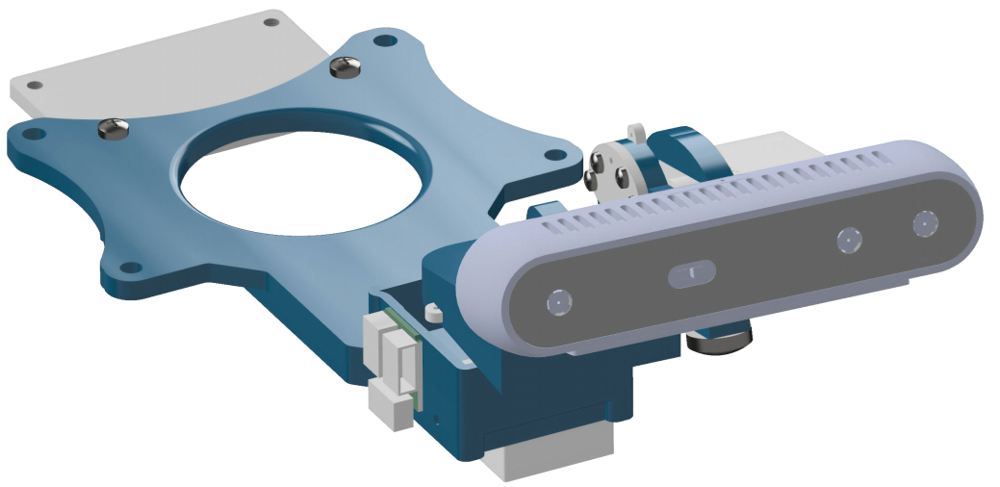
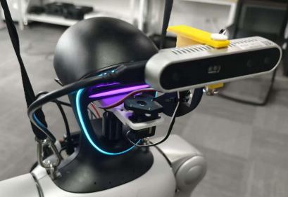

# OpenNeck

  
  

  <strong>English:</strong>
  <a href="docs/en/software.md">Software</a> ·
  <a href="docs/en/hardware.md">Hardware</a> ·
  <a href="docs/en/assembly.md">Assembly</a>
   
  <strong>中文：</strong>
  <a href="docs/zh-CN/software.md">软件</a> ·
  <a href="docs/zh-CN/hardware.md">硬件</a> ·
  <a href="docs/zh-CN/assembly.md">装配</a>

OpenNeck is an open-source 2-DoF robotic neck gimbal. The repository provides 3D-printable mechanical parts, a physical-angle-based software driver, and standalone URDF and MuJoCo simulation models.

## Project Contents

- **Mechanical hardware**: editable STEP models, print-ready STL models, a sourcing list, and assembly instructions.
- **Software driver**: a Python API, command-line tools, servo maintenance tools, and procedures for center and mechanical-limit calibration.
- **Simulation models**: standalone URDF and MuJoCo XML models with their supporting meshes.

## Documentation

| Topic | Document |
|---|---|
| Software installation, calibration, configuration, CLI, and API | [Software Driver](docs/en/software.md) |
| Hardware sourcing and 3D printing | [Hardware Preparation](docs/en/hardware.md) |
| Mechanical installation | [Mechanical Assembly](docs/en/assembly.md) |
| URDF model | [openneck.urdf](hardware/simulation/openneck.urdf) |
| MuJoCo model | [openneck.xml](hardware/simulation/openneck.xml) |

## Getting Started

When building OpenNeck for the first time, follow these documents in order:

1. Use [Hardware Preparation](docs/en/hardware.md) to source the components and print the structural parts.
2. Follow [Mechanical Assembly](docs/en/assembly.md) to assemble the gimbal.
3. Follow [Software Driver](docs/en/software.md) to install the driver, assign servo IDs, and complete calibration.

## Acknowledgments

The hardware design and implementation of OpenNeck were completed by [zc-xzc](https://github.com/zc-xzc).

## License

This project is licensed under the [Apache License 2.0](LICENSE).
