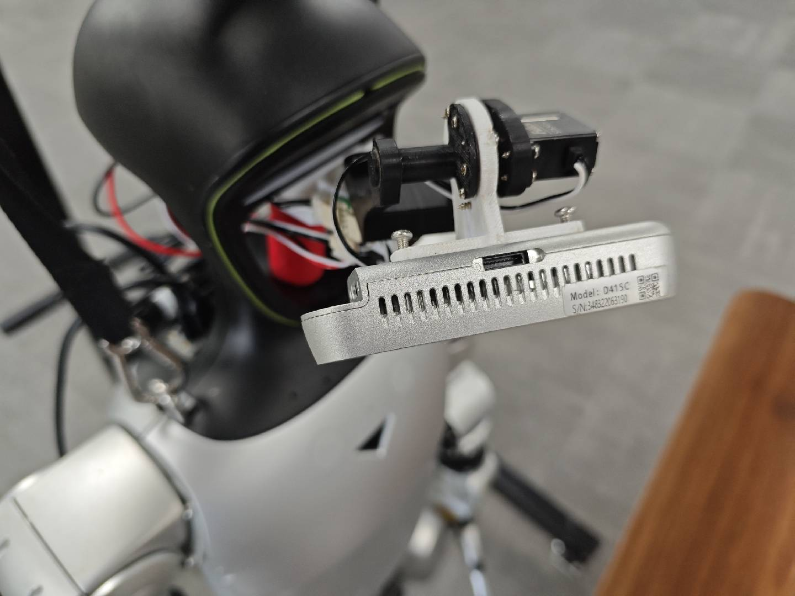

# OpenNeck

  

OpenNeck 是一个开源的两自由度机器人头颈云台，仓库同时提供可 3D 打印的机械结构、基于物理角度控制的软件驱动，以及独立的 URDF 和 MuJoCo 仿真模型。

## 项目内容

- **机械硬件**：可编辑的 STEP 模型、可直接切片的 STL 模型、采购清单和装配说明。
- **软件驱动**：Python API、命令行工具、舵机维护工具，以及中位和机械限位标定流程。
- **仿真模型**：可独立使用的 URDF、MuJoCo XML 和配套网格。

## 文档导航

| 内容 | 文档 |
|---|---|
| 软件安装、配置、API、标定和 CLI | [软件驱动文档](docs/software-driver.md) |
| 硬件采购清单和机械资源 | [Hardware README](hardware/README.md) |
| 机械装配 | [OpenNeck 机械装配说明](hardware/ASSEMBLY.md) |
| 3D 打印文件 | [3D 打印说明](hardware/3d_prints/README.md) |
| URDF 模型 | [openneck.urdf](hardware/simulation/openneck.urdf) |
| MuJoCo 模型 | [openneck.xml](hardware/simulation/openneck.xml) |

## 开始使用

首次搭建 OpenNeck 时，建议依次完成：

1. 按[硬件采购清单](hardware/README.md)准备零件并打印结构件。
2. 按[机械装配说明](hardware/ASSEMBLY.md)完成云台装配。
3. 按[软件驱动文档](docs/software-driver.md)安装驱动、设置舵机 ID 并完成标定。

如果机械部分已经完成，可以直接从[软件驱动文档](docs/software-driver.md)开始。

## 许可证

本项目基于 [Apache License 2.0](LICENSE) 开源。
