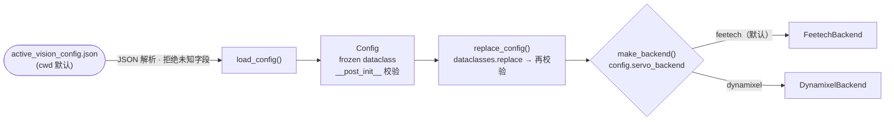
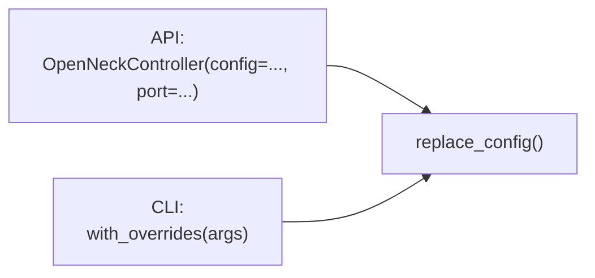
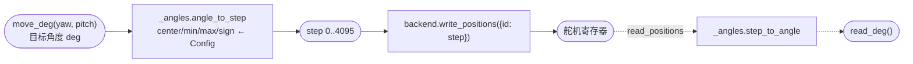
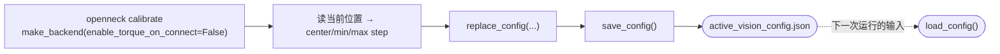

# 配置数据流（config-dataflow）

[状态](../../STATUS.md) · [设计合同](twist2-dynamixel-design.md) · [根 AGENTS](../../AGENTS.md)

本文说明 `openneck` 包的配置如何流转：文件加载、校验、运行时 override、后端选择，以及配置如何参与角度换算。只讲机制；字段取值与完整模型见[设计合同](twist2-dynamixel-design.md)，约定理念见 [`ref/doc-conventions.md`](ref/doc-conventions.md)。

## 总览

配置从 `active_vision_config.json` 进入，经 `load_config` 解析并拒绝未知字段，构造 `Config` 时由 `__post_init__` 全量校验。运行时可用 `replace_config` 叠加 override（再校验一次），最后 `make_backend` 按 `servo_backend` 选后端。`Config` 一旦构造完成即可信，后续模块只读它。

## 配置载体：`Config`

`openneck/_config.py` 的 `Config` 是 `@dataclass(frozen=True)`，字段分四组：

- 总线：`port`、`baudrate`
- 舵机 ID：`yaw_id`、`pitch_id`
- 每轴标定：`{yaw,pitch}_center_step` / `_min_step` / `_max_step` / `_step_sign`
- 运动/后端：`speed`、`acceleration`、`servo_backend`、`operating_mode`、`profile_velocity`、`profile_acceleration`

`__post_init__` 校验类型与范围、`min ≤ center ≤ max`、`yaw_id ≠ pitch_id`、`servo_backend ∈ {feetech, dynamixel}`、`operating_mode ∈ {0,1,3,4,5,16}`（拒绝 `bool`）、`profile_*` 非负。frozen 保证构造后不可变。

## 加载：`load_config`

`load_config(path=None, *, allow_missing=False)`：

- `path=None` 时读当前工作目录的 `active_vision_config.json`。
- 文件不存在：`path is None` 或 `allow_missing=True` 返回默认 `Config()`；否则抛 `FileNotFoundError`。
- 读到的 JSON 必须是对象；未知字段（不在 `fields(Config)` 里）直接报 `unsupported field`。
- 最后 `Config(**data)` 触发 `__post_init__`。

## 运行时 override：`replace_config`

`replace_config(config, **changes)` 用 `dataclasses.replace` 生成新 `Config`，再走一次 `__post_init__`，所以 override 同样被校验。两条路径用它：

- API（`openneck/api.py`）：构造器加载配置后用 `replace_config(loaded, port=port)` 覆盖端口。
- CLI（`openneck/cli.py`）：`with_overrides(args)` 遍历一组键，把命令行里非 `None` 的 `--xxx` 合并进配置。

CLI 可 override 的键覆盖全部字段：`port`、`baudrate`、`yaw_id`、`pitch_id`、各 `*_center/min/max_step`、`*_step_sign`、`speed`、`acceleration`、`servo_backend`、`operating_mode`、`profile_velocity`、`profile_acceleration`。

## 后端选择：`make_backend`

`openneck/_backends/factory.py` 的 `make_backend(config, *, enable_torque_on_connect=True)` 读 `config.servo_backend`：

- `"feetech"` → `FeetechBackend`
- `"dynamixel"` → `DynamixelBackend`
- 其它 → `ValueError`

`enable_torque_on_connect` 控制连接时是否使能力矩。控制类命令默认 `True`；`calibrate`、`voltage` 传 `False`。

## 运行时控制流

配置如何参与一次角度写入与回读：

角度到 step 的换算用的 `center/min/max/sign` 全部取自 `Config`，所以标定改了配置，换算就跟着变。`read_deg` 反向：`backend.read_positions()` 返回 step，再经 `step_to_angle` 还原成角度。

## 配置生成：`calibrate` 闭环

`openneck calibrate` 既消费配置又产出配置：

标定时用 `make_backend(..., enable_torque_on_connect=False)` 连接（不使能力矩，便于手动搬动），读当前位置算出 `center/min/max step`，经 `replace_config` 校验后由 `save_config` 写回 `active_vision_config.json`。配置文件因此既是运行输入，也是标定输出。

## 不变量

- `Config` 不可变；任何变更（override、标定结果）都经 `replace_config` 重建并再校验。
- 三道校验关卡：`load_config`（未知字段）、`Config.__post_init__`（字段语义）、`replace_config`（override 后再过一次 `__post_init__`）。
- 后端选择只看 `servo_backend` 一个字段；两个后端实现同一个 `ServoBackend` Protocol，控制层（`OpenNeckController`）不感知具体后端。
