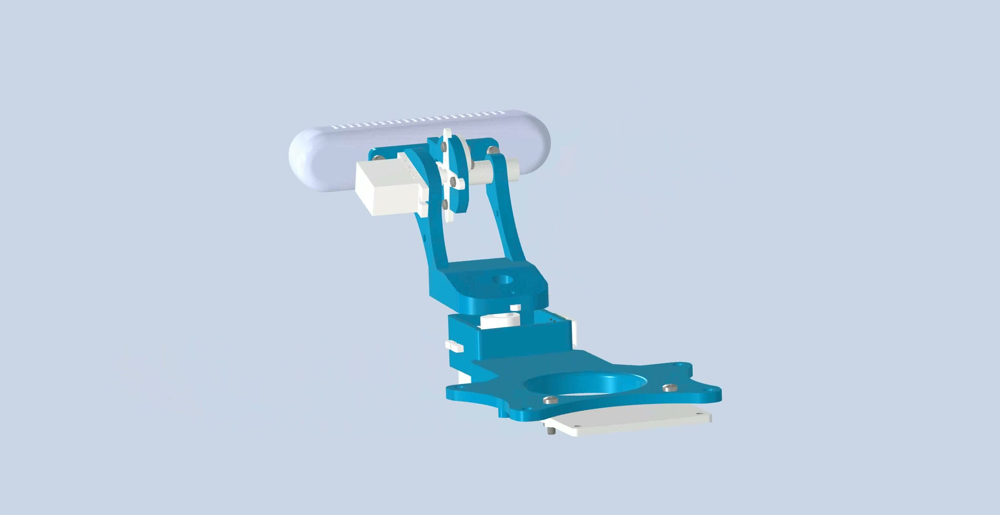

# OpenNeck 机械装配

[主页](../../README.md) · [软件](./software.md) · [硬件](./hardware.md) · [装配](./assembly.md) · [English](../en/assembly.md) · **中文**

全程断电操作。先认准三个方向：D415 镜头朝前，yaw 舵机输出轴朝上，pitch 舵机输出轴水平。

## 准备

打印件每种 1 个：`base_mount`、`pitch_mount`、`camera_mount`、`pitch_pivot`。还需要 2 个 ST-3032 舵机、2 个舵盘、D415、URT-2 和舵机转接板；完整清单见[硬件准备](./hardware.md)。

先清理打印件的支撑和孔内毛刺，再按用途分好螺丝：

| 螺丝 | 数量 | 用途 |
|---|---:|---|
| ST2.2 × 4.5 自攻螺丝 | 12 | 两个舵机、舵机转接板 |
| M6 × 8 | 1 | D415 |
| M3 × 6 | 2 | 摄像头支架 |
| M3 × 12 + M3 薄螺母 | 各 2 | URT-2 |

## 1. 装底座

1. 把 yaw 舵机放进 `base_mount` 后部的方槽，输出轴朝上，用 4 颗 ST2.2 × 4.5 固定。
2. 把舵机转接板装在方槽外侧，接口朝外，用 4 颗 ST2.2 × 4.5 固定。
3. 把 yaw 舵盘套在输出轴上，先不要锁死。
4. 把 URT-2 装在底座前端下方，用 2 颗 M3 × 12 和 2 个 M3 薄螺母固定。

## 2. 装上半部分

1. 把 pitch 舵机水平放进 `pitch_mount`，用余下的 4 颗 ST2.2 × 4.5 固定。
2. D415 镜头朝前放到 `camera_mount` 上，从底部拧入 1 颗 M6 × 8。
3. 把 `camera_mount` 放到 `pitch_mount` 两臂之间：舵机侧装舵盘，另一侧插入 `pitch_pivot`。
4. 确认两侧同轴后，用 2 颗 M3 × 6 固定摄像头支架；pitch 舵盘暂时不要锁死。

## 3. 合体

1. 镜头保持朝前，将上半部分放到 yaw 舵机正上方。
2. 对准 yaw 舵盘和底部孔位，保持水平，垂直压合。
3. 两个安装面贴合后，锁紧 yaw 和 pitch 舵盘自带的紧固件。

## 4. 检查

断电状态下，用手缓慢转动 yaw 和 pitch：

- 两个方向都应顺畅，没有碰撞、刮擦或卡滞；
- D415 居中、镜头无遮挡；
- 舵机、舵盘和两块电路板没有松动；
- 线缆在整个活动范围内不会被拉紧或夹住。

> 自攻螺丝拧到螺丝头贴合即可，过紧会撑裂打印件。D415 只能使用 M6 × 8，不要换成长螺丝。
